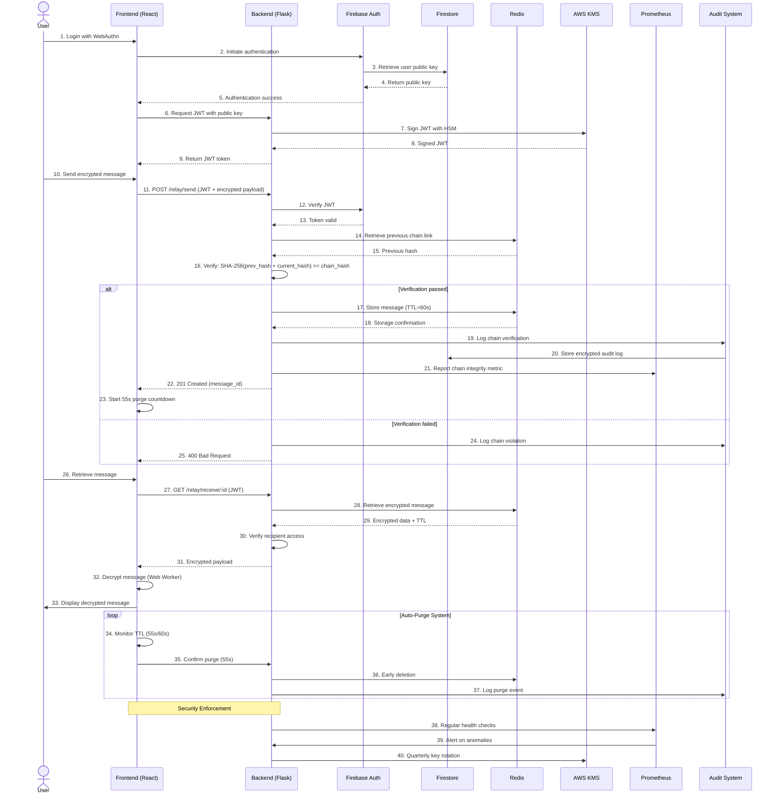
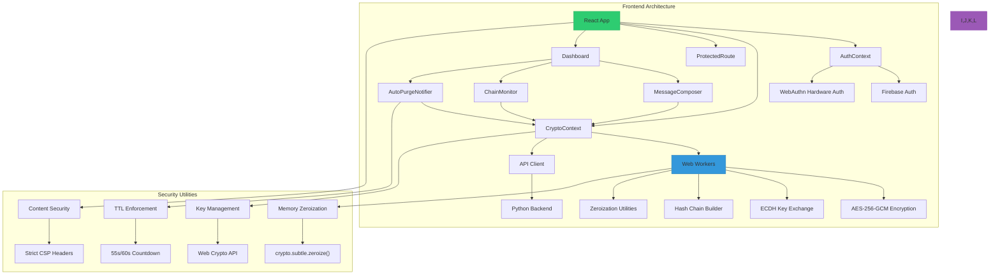
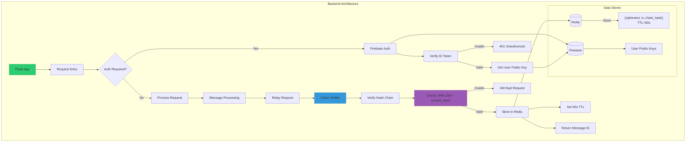
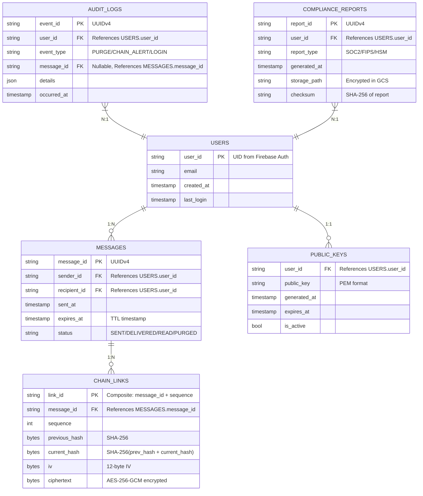

[](https://github.com/gongahkia/mustang/releases/tag/1.0.0) 

# `Mustang` 🔥

Cryptographically-secure Communication Platform with [Auto-destructing messages](./client/src/utils/purgeService.js), [Client-side Encryption](./client/src/crypto/) and [Hash Chaining](./server/src/chain/).

## Stack

* *Frontend*: [React](https://react.dev/), [TypeScript](https://www.typescriptlang.org/), [Vite](https://vite.dev/)
* *Backend*: [Flask](https://flask.palletsprojects.com/en/stable/), [Python](https://www.python.org/), [Gunicorn](https://gunicorn.org/), [Heroku](https://www.heroku.com/)
* *Package*: [Docker](https://www.docker.com/)
* *Cache*: [Redis](https://redis.io/about/)
* *DB*: [Firebase Firestore](https://firebase.google.com/docs/firestore)
* *Auth*: [Firebase Auth](https://firebase.google.com/docs/auth), [WebAuthn](https://webauthn.io/), [JWT](https://jwt.io/)
* *CI/CD*: [Github Actions](https://github.com/features/actions)

## Rationale

Ever since learning about the tech behind [classic blockchain systems](https://en.wikipedia.org/wiki/Blockchain), I couldn't shake the feeling that its [immutable, tamper-resistant](https://log-locker.com/en/blog/the-importance-of-immutable-and-tamper-proof-data-in-compliance) properties would be beneficial for developing a secure, zero-trust communication tool. 

With that in mind, I threw together `Mustang`.

`Mustang` is a Security-first Communication Platform-as-Framework designed to provide [Zero-trust](https://www.cloudflare.com/learning/security/glossary/what-is-zero-trust/), [TTL-based](https://en.wikipedia.org/wiki/Time_to_live) temporal messaging. It achieves this by integrating Client-side [AES-256-GCM Encryption](https://en.wikipedia.org/wiki/Galois/Counter_Mode) with [ECDH key exchange](https://en.wikipedia.org/wiki/Elliptic-curve_Diffie%E2%80%93Hellman), reinforced by [Cryptographic hash chaining](https://en.wikipedia.org/wiki/Hash_chain) and Redis' [Ephemeral storage](https://redis.io/docs/latest/operate/rs/installing-upgrading/install/plan-deployment/persistent-ephemeral-storage/) to guarantee [Message integrity](https://www.geeksforgeeks.org/computer-networks/message-integrity-in-cryptography/) and zero [Plaintext persistence](https://en.wikipedia.org/wiki/Persistence_(computer_science)) even over Server-facilitated transmission.

`Mustang` also acts as my [second](https://github.com/gongahkia/kiwi) official foray into the Cyber Security space, so there's much I still have to learn. Please [***open an issue***](https://github.com/gongahkia/mustang/issues) to help improve `Mustang`. I appreciate any guidance I can get.

## Usage

The below instructions are for locally hosting `Mustang`.

1. First execute the below.

```console
$ git clone https://github.com/gongahkia/mustang && cd mustang
```

2. Then run the below to start up the [Frontend](./client/) and [Backend](./server/).

```console
$ docker run -d -p 6379:6379 --name mustang-redis redis:7-alpine
$ cd server && python app.py & SERVER_PID=$! && cd ..
$ cd client && npm run dev
```

3. Alternatively, run the below to run [unit tests](./tests/).

```console
$ npm --prefix client test
$ cd server && pytest && cd ..
```

4. Run the below to run [load tests](./tests/).

```console
$ cd server && gunicorn --config config/gunicorn.conf.py wsgi:app & SERVER_PID=$! && cd ..
$ k6 run tests/load/api_load_test.js
$ k6 run tests/load/crypto_benchmark.js
$ k6 run tests/load/websocket_test.js
$ kill $SERVER_PID
```

5. Run the below to run [security and fuzz tests](./tests/).

```console
$ python -m unittest tests/fuzz/api_security_test.py
$ zap.sh -cmd -config tests/fuzz/zap_baseline.conf
$ zap.sh -cmd -config tests/fuzz/zap_full_scan.conf
```

## Architecture

### Overview



### Frontend



### Backend



### DB



## Reference

The name `Mustang` is in reference to [Roy Mustang](https://fma.fandom.com/wiki/Roy_Mustang) (ロイ・マスタング), (also referred to as the [Flame Alchemist](https://angel-bazethiel.tumblr.com/post/628930233049006080/what-how-why-is-flame-alchemy)), a [State Alchemist](https://fma.fandom.com/wiki/Alchemist#State_Alchemist) and [Officer](https://fma.fandom.com/wiki/Military_Ranks) of the [Amestris](https://fma.fandom.com/wiki/Amestris) [State Military](https://fma.fandom.com/wiki/State_Military). Roy is generally recognised as the tritagonist of the completed manga series [Fullmetal Alchemist](https://fma.fandom.com/wiki/Fullmetal_Alchemist_(Franchise)).

<div align="center">
    
</div>

## Research

...