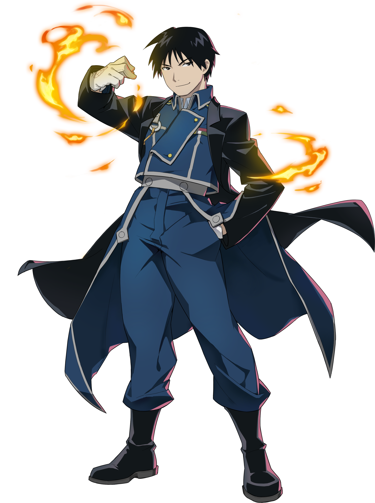

[](https://github.com/gongahkia/mustang/releases/tag/1.0.0) 

# `Mustang` 🔥

...

## Rationale

...

## Stack

...

## Usage

```console
$ 
```

...

## Screenshot

...

## Architecture

...

## Reference

The name `Mustang` is in reference to [Roy Mustang](https://fma.fandom.com/wiki/Roy_Mustang) (ロイ・マスタング), (also referred to as the [Flame Alchemist](https://angel-bazethiel.tumblr.com/post/628930233049006080/what-how-why-is-flame-alchemy)), a [State Alchemist](https://fma.fandom.com/wiki/Alchemist#State_Alchemist) and [Officer](https://fma.fandom.com/wiki/Military_Ranks) of the [Amestris](https://fma.fandom.com/wiki/Amestris) [State Military](https://fma.fandom.com/wiki/State_Military). Roy is generally recognised as the tritagonist of the completed manga series [Fullmetal Alchemist](https://fma.fandom.com/wiki/Fullmetal_Alchemist_(Franchise)).

<div align="center">
    
</div>